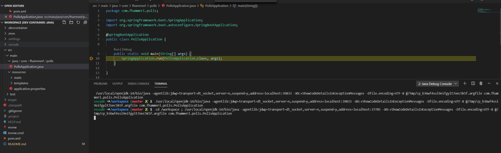

# Backend Engineer hiring challenge - Ferenc Hammerl

## How do I use it?
If you can't wait to try this api, you're at the right place. 
Run:
```
docker-compose up
```
in the polls folder, wait for Docker and Maven to do their thing, then fire away.
### 1. List all polls created by a user
GET: `http://localhost:8080/api/v1/polls/createdBy?userId=4`

_Challenge: make it return a 500 (one answer in the controller)_
### 2. Search polls by its title
POST: `http://localhost:8080/api/v1/polls/search`

RequestBody:
```
{
    "title":"谁是最坏蛋奇迹超级英雄?"
}
```
### 3. List all polls created after a certain date

GET: `http://localhost:8080/api/v1/polls/listFrom?fromDate=2019-06-01`   - all 3 polls

GET: `http://localhost:8080/api/v1/polls/listFrom?fromDate=2020-05-15`   - only 2

GET: `http://localhost:8080/api/v1/polls/listFrom?fromDate=2020-06-15`   - none
***
## Getting started

### Discovery
I started by registering an account on Doodle and playing around a bit with my dashboard. Creating polls, participating in them as different users, checking out the request to `https://api.doodle.com/v2.2/users/me/polls` and its response. 

### Analysys
After analyzing polls.json, I came up with the two tables I need to create to complete the tasks.

### User stories


### 1. List all polls created by a user
Create an endpoint that takes an integer `userId` param and returns with an empty list or a list of polls that the user created

### 2. Search polls by its title
Create an endpoint that takes a string `title` param and returns with an empty list or a list of polls with the exact title

### 3. List all polls created after a certain date
Create an endpoint that takes an ISO date `date` in param and returns with an empty list or a list of polls with `initiated` post the date param. 
As a timestamp, the date 2020-01-01 is 2020-01-01 00:00, so an initiated timestamp of 2020-01-01 01:00 is 'after' 2020-01-01

## Technology choices
### Visual Studio Code + Remote Development / Dev Containers
With VS Code Remote Development, you can use a Docker container as a full-featured development environment. VS Code is going to work **as if it was running locally on the Linux container** I chose to develop on. Other tools offer similar solutions of course (mounting the workspace, hot-reload), but I find the extreme approach of hooking the entire "IDE" into a container quite inspiring. 


To open the dev container:
- Open the folder in VS Code
- Reopen in container (popup in bottom right of the window)
- Find a Java file, hit F5
- Say yes to Java standard mode (popup in bottom right of the window)
- After a minute and the Java mode switch, you're in - now you're developing on a 'remote' machine. Move it to the cloud and you've got GitHub CodeSpaces.

More about dev containers: https://stuartleeks.com/posts/vscode-devcontainers/

Debugging inside the container:


Note: While VS Code is great for smaller Java projects, it's not mature enough for complex, multi-project Java solutions.

### Spring Boot
Nothing really comes close.

### PostgreSQL
Easy integration with Java, UUID as primary key natively, can index JSON objects.
***
## If I had more time...
I would 
- Test more!
- *Observability*: request tracing and logging for both the DB and the service
- Performance: 
  - Add an index for the `title` and `initiated` column (if we want it them be really fast)
  - Consider replacing Tomcat with Undertow (slightly better throughput afaik)
  - Based on polls.json, the database has a lot more tables than what I modeled. We could consider preloading some sort of cache storage (probably NoSQL) as the poll is created
  - Read heavy system calls for read replicas
- Refactorings: 
  - Find a better home for `SearchQuery.java`
  - Add some sort of linting / auto formatter
  - If only I could find some automapping from Postres snake_case to camelCase...
- Nicer `docker-compose`: Work on making it a bit more configurable production ready, like using the devcontainer image for building and a jre image for running
  
## What I'd do differently

- Consider dropping the ORM in favour of DTOs: While I had fun with the ORM, some queries into POJOs would have done the job much faster.
- Have much less trouble using dev containers (First time using them for Java!)
- Not forget about adding the user_id to the 
